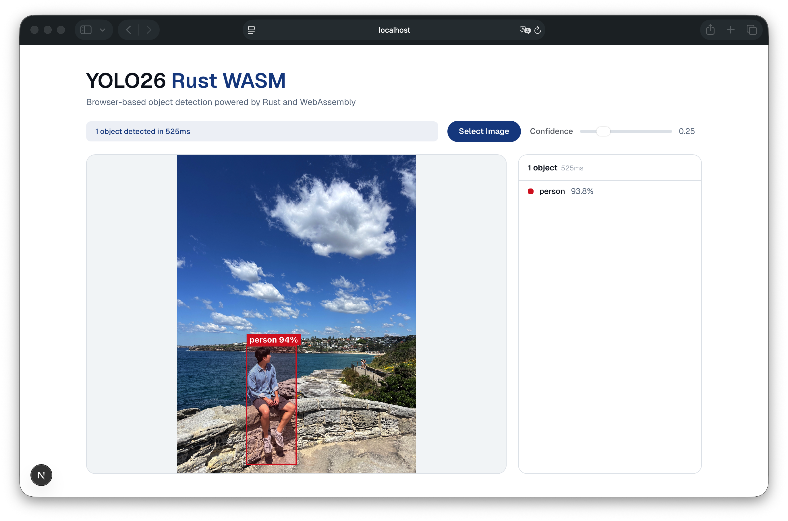

# YOLO26 Rust WASM

Real-time object detection running entirely in the browser — no server, no upload, no API calls. The YOLO26n model is implemented natively in Rust using [candle](https://github.com/huggingface/candle) and compiled to WebAssembly.



## Why This Exists

Most browser-based ML demos rely on ONNX Runtime or TensorFlow.js. This project takes a different approach: the entire YOLO26n architecture is implemented from scratch in Rust and compiled to WASM. Every layer — convolutions, batch norm, attention, detect head — runs as native Rust code in the browser.

This means:

- **Zero server dependency** — inference happens on the client. No data leaves the browser.
- **No runtime framework** — no ONNX, no TF.js. Just Rust → WASM → Canvas.
- **Portable** — one 1.2 MB `.wasm` binary + 5 MB SafeTensors weights. Works anywhere WebAssembly runs.

## Features

- YOLO26n model (2.4M params) natively implemented in Rust
- SafeTensors weight loading (~5 MB FP16)
- WASM SIMD128 acceleration for vectorized matrix operations
- Web Worker inference (non-blocking UI)
- EXIF-aware image handling for correct orientation
- Confidence threshold slider (filters without re-running inference)
- Click-to-zoom full resolution view
- Responsive viewport-fit layout
- 36 unit tests covering all building blocks and full pipeline

## Architecture

```
Browser (Next.js + Web Worker)
  │ File → createImageBitmap (EXIF-normalized)
  │ → Canvas → RGBA pixels
  ▼
Rust WASM Module (candle)
  ├── preprocess.rs    → Bilinear resize, letterbox 640×640, normalize, HWC→CHW
  ├── model/
  │   ├── backbone.rs  → Conv, C3k2, SPPF, C2PSA (layers 0-10)
  │   ├── neck.rs      → FPN-PAN feature fusion (layers 11-22)
  │   └── head.rs      → Detect: end2end, topk-300, NMS-free (layer 23)
  └── postprocess.rs   → [1,300,6] → coord transform → JSON
  ▼
Canvas 2D (bounding boxes + labels)
```

## Prerequisites

- Rust (stable) with `wasm32-unknown-unknown` target
- `wasm-pack`: `cargo install wasm-pack`
- Node.js 18+ (for the web app)
- Python 3 + `ultralytics` + `safetensors` (for model export only)

## Quick Start

### 1. Export Model Weights

```bash
pip install ultralytics safetensors
./scripts/download_model.sh
```

### 2. Build WASM

```bash
wasm-pack build --target web --release
```

SIMD is enabled automatically via `.cargo/config.toml`.

### 3. Run Web App

```bash
cd web
cp -r ../pkg/yolo26_rust_wasm{.js,_bg.wasm} public/wasm/
ln -sf ../../weights public/weights
npm install && npm run dev
```

Open http://localhost:3000.

## WASM API

```rust
// Load SafeTensors model (called once)
init_model(weights: &[u8]) -> Result<(), JsValue>

// Run detection on RGBA pixels
detect(pixels: &[u8], width: u32, height: u32, confidence_threshold: f32) -> Result<String, JsValue>
```

## Testing

```bash
cargo test
```

36 tests covering preprocessing, postprocessing, all building blocks (ConvBlock, Bottleneck, C3k2, C3k, SPPF, C2PSA, Attention), backbone, neck, detect head, and full pipeline.
